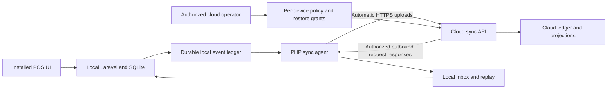

# Pharmacy POS: project review and implementation brief

Reviewed: 20 September 2026. Repository baseline: `c044e9a`.

This document contains a refined implementation prompt, a source-based gap review, a target architecture, sample Laravel code, and acceptance criteria. It is a specification for extending this application, not a claim that the proposed features are implemented. “phpNative” is interpreted as **NativePHP**.

## 1. Refined prompt to give an implementation LLM

> Extend this existing Laravel 12, Vue 3, TypeScript, and Inertia pharmacy POS into an offline-capable, multi-tenant, multi-branch application with NativePHP clients and a cloud server. Preserve existing working features and data. Read this document and the referenced code before implementing changes.
>
> Maintain one shared business application and domain model, with separately built cloud, desktop, and mobile distributions. Use explicit, validated environment configuration to select the deployment role. Retain the existing `SYNC_ROLE=parent|child` vocabulary unless performing a documented compatibility migration. A parent is the cloud server; a child is an installed client. Desktop targets are Windows and macOS; mobile targets are Android and iOS. Treat Linux as an optional additional target. Prove NativePHP package, PHP runtime, and existing Inertia UI compatibility in a small platform prototype before committing to build configuration.
>
> Each installed client must run its PHP business logic and persistent database locally. Once activated and provisioned, authorized users must be able to sign in, search products, manage permitted inventory and customers, complete sales and returns, and print supported receipts without internet. A sale must commit all local business changes and its durable outbound event in one transaction. Internet failure must never invalidate an already committed sale.
>
> Use the existing event ledger as the durable outbox. Automatically upload client-originated events when the app can reach the cloud. Upload retries must survive restarts, lost responses, and prolonged outages. Retrying an event must not duplicate sales, stock movements, or accounting entries. The cloud must authenticate a unique device credential and derive account and branch scope from the device registration, not from caller-supplied IDs. Validate every nested reference, event type, version, and allowed operation before accepting an event.
>
> The cloud operator must control downloads separately for each device: disable business-data downloads, enable continuous downloads, or grant a bounded restore. Uploads remain automatic for active devices even when business-data downloads are disabled. Provide a cloud-only control panel for policies, restore requests, device revocation, failures, conflicts, and synchronization progress. A server notification signals work; the client obtains data through an authenticated outbound request. Synchronization must still recover when notifications are missed.
>
> Represent a tenant using the existing `account_id`; a tenant owns branches, and each installation has a registered device identity bound to one branch. Enforce tenant and authorized branch boundaries in routes, services, queries, jobs, caches, exports, event replay, and database constraints. Tenant owners see only their pharmacy; cross-tenant operator access is separately authorized and audited. Cloud administration routes, permissions, navigation, and build assets must not be available in client distributions. Changing a local environment value must never grant cloud privileges.
>
> Embed the cloud URL and public verification keys in client builds. Provision a unique revocable device token at activation, then store it using platform-secure storage through a PHP-side credential abstraction. Do not distribute a shared cloud token, cloud database credentials, or signing private keys. If individually provisioned installers are required, inject only that installation's restricted bootstrap credential and exchange it during activation.
>
> Implement deterministic versioned events, payload authorization, atomic replay, cursor-based pagination, per-device download policy, conflict handling, safe restore, migration compatibility, encrypted backups, and an observable sync status screen. Restore must preserve unsynced events and must be resumable without clearing the only working database first. Define inventory authority explicitly; independent disconnected devices must not each assume they own the entire same stock balance.
>
> Deliver additive migrations, code, tests, configuration examples, native build instructions, cloud deployment instructions, and an updated project README. Work in the phases in this document. Add regression tests for the confirmed defects first. Do not silently rewrite historical event hashes, delete failed outbound events, replace ULID identities, create a second tenant abstraction, or claim background sync continues while a mobile OS has suspended the app. Report implemented behavior, actual test results, and remaining limitations.

## 2. What the project already contains

This is more than a starter application, although its README still describes the Laravel starter kit.

| Area | Existing implementation | Assessment |
|---|---|---|
| Stack | `composer.json`, `package.json` | Laravel 12, PHP constraint `^8.2`, Vue 3, Inertia 2, Sanctum, Fortify, Reverb, ABAC package, Laravel Modules. |
| Pharmacy operations | `app/Services/SaleService.php`, `InventoryService.php`, `ReturnService.php`, associated controllers and Vue pages | Sales, batches, stock, transfers, returns, customers, tax snapshots, prescription metadata, reporting. |
| Tenant and branch identity | `app/Models/Account.php`, `Branch.php`, `Device.php`, ABAC tenant integration | Existing account abstraction should be retained. Recent migrations add branch ownership and backfill legacy data. |
| Device activation | `ActivationController.php`, `SetupController.php`, `VerifySyncToken.php` | Activation issues per-device tokens; server stores SHA-256 token hashes; local setup encrypts a token in settings. |
| Offline licensing | `LicenseService.php`, `EnsureLicensed.php` | RSA verification, identity-bound claims, expiry and grace support already exist. |
| Outbound history | `EventLedgerService.php`, `DomainEventService.php` | ULIDs, per-device local sequence, previous hash, transactional recording, queue dispatch. |
| Cloud ingestion | `CloudSyncController::receiveBatch()` | Verifies envelope account/branch/device ownership and hashes, assigns global sequences, recognizes repeated IDs, retries pending projections. |
| Downloads and restore | `SyncService.php`, `CloudSyncController.php` | Incremental pulls, access snapshots, replay, and a full-restore endpoint exist. |
| Replay | `ProjectionService.php`, `projected_events` | Supports sales, returns, stock, drugs, customers, batches, taxes, settings, and branches with a projection marker. |
| Background scheduling | `routes/console.php`, `SyncEventsToCloudJob.php`, `PullCloudEventsJob.php` | Minute heartbeat and bounded retries exist. Configured queue connections already set `after_commit=true`; preserve this. |
| UI sync indicators | `resources/js/services/SyncManager.ts`, `components/SyncStatus.vue` | Network hints and Echo events trigger local sync routes. |
| Tests | `tests/Feature/Sync/SyncPipelineTest.php`, `PharmacyIntegrityTest.php`, other feature tests | Meaningful baseline tests exist; extend them rather than replacing them. |

Current flow: Vue calls the Laravel instance serving the app. Services mutate its database and record ledger events. A sync job sends unassigned events to the configured cloud. The cloud appends and projects them. Clients pull account events and replay them locally. This can become offline operation when Laravel runs on the device; visiting a remotely hosted Inertia app alone does not provide local PHP execution.

Review limits: this was a static source review, not a penetration test or a successful native build. `vendor/` was absent, so framework tests and route-resolution checks were not run. PHP 8.4.22 syntax checks passed for 263 repository PHP files and all eight PHP examples in this document; this proves parsing only. The ABAC dependency's vendor implementation was unavailable; its tenant detection and scope behavior require integration tests. Existing tests often mock tenant context, which does not prove real middleware isolation.

## 3. Confirmed gaps and risks, in implementation order

Paths in this section are relative to the repository. Controller names refer to `app/Http/Controllers/Api/v1/` unless stated otherwise.

| ID / priority | Source evidence | Consequence and required correction |
|---|---|---|
| G01 / P0 | `ProjectionService::projectEvent()` uses unscoped ID-only `updateOrCreate()` for customers, taxes, batches, inventory, branches, and sales. Some payload merges use `$payload + ['account_id' => $accountId]`. `receiveBatch()` validates the envelope, not all payload references. | A valid device can submit its own envelope containing another tenant's known entity ID or a different nested account ID. Array union preserves a supplied payload account. Enforce ownership and allowlisted fields before ingestion and during replay; collision with a foreign ID must fail, never move ownership. |
| G02 / P0 | `SyncService::restoreFromCloud()` calls `resetReadModels()` and replays only returned cloud events. The reset deletes all account sales, returns, and inventory and clears all account projection markers. | Unsynced work remains in the ledger but can disappear from operational tables. Legacy rows can also be lost despite the reset comment. Restore into staging, preserve pending events, validate completeness, then swap atomically. Restrict restore to a dedicated permission. |
| G03 / P0 | `CloudSyncController::serveBatch()` and `fullRestore()` filter by account only. `VerifySyncToken` checks device trust, but no per-device download/restore policy exists. | Any active device can retrieve the account's full business event history and access snapshot. Add server-enforced download modes, scope, policy revision, and bounded restore grants to both endpoints. |
| G04 / P0 | Cloud receive/serve/restore routes are registered for both roles in `routes/api.php`. Activation actions do check role, but sync routes do not. | Role configuration is only a partial boundary. Register cloud routes only for parent builds and add runtime middleware; omit operator pages and assets from child builds. Cloud authorization must remain independent of local role settings. |
| G05 / P0 | `SaleItemController::updateDosageInstructions()` finds `SaleItem` by ID; the model has no tenant trait; request `authorize()` returns true. No ownership check follows and no event is emitted. | A caller with the route capability and another sale-item ID can update an unscoped item. Scope via its sale's account and authorized branch, then record a dosage amendment event in the same transaction. |
| G06 / P1 | `composer.json`, `composer.lock`, and `config/` contain no NativePHP integration or native build pipeline. | Desktop/mobile offline executables are not implemented. Add platform adapters, persistent app-data paths, lifecycle hooks, signing, upgrade handling, and tested hardware support. |
| G07 / P1 | `SyncService::push()` skips rows leased as `syncing` for five minutes. Parallel callers can select later rows from the same device. The scheduler's overlap lock covers dispatch, not execution. | Later sequences can reach the cloud before earlier sequences. Serialize upload work per device and enforce a contiguous unacknowledged prefix; add expiring leases and fencing. |
| G08 / P1 | `CloudSyncController::receiveBatch()` changes `$previous` to an old duplicate event while iterating, and projections run after the ledger transaction. | Overlapping retries need explicit ordering rules; replay jobs can interleave even though insertion is globally sequenced. Keep the actual stream head separate from duplicate handling and serialize dependent projections. Test mixed duplicate/new batches. |
| G09 / P1 | `SyncService::push()` accepts returned assignment IDs without restricting them to the submitted batch; partial or zero-processed empty acknowledgements are not immediately resolved. | Malformed responses can update unrelated local rows or leave work leased while reporting success. Validate exact/subset acknowledgement semantics, ownership, positive sequences, and immutable mappings; requeue unacknowledged rows. |
| G10 / P1 | `EventValidationService` is essentially a placeholder; `EventVersioningService` declares a sale v2 without an implemented migration; replay does not invoke it. Unknown replay types still receive a projection marker. `EventLedgerService` hashes a supplied version but does not persist it explicitly; pull omits version/category. | Unsupported or malformed events can be accepted without correct business effects; non-default versions may fail integrity after round trips. Add a strict registry, persist all envelope fields, version hash serialization, and reject unsupported types before commit. |
| G11 / P1 | `ProjectionService` supports absolute `INVENTORY_UPSERTED` quantity values as well as additive stock changes. `ConflictResolutionService` exists but is not wired into the reviewed receive/project path. | A stale absolute update can overwrite sales depletion; independent offline devices can oversell shared physical stock. Introduce inventory authority/allocations and immutable movements; never resolve quantities by device wall-clock timestamps. |
| G12 / P1 | `AccessSnapshotService::export()` returns account users' password hashes and gathers roles through all those users' role memberships. Imports replace records without fully checking every nested ownership relationship. | Compromising one device exposes broad offline credentials; users belonging to multiple accounts need stricter role selection. Send only permitted identities and roles, separate local authentication, validate snapshots, and test removal/revocation as well as addition. |
| G13 / P1 | Activation chooses `$user->accounts()->first()`, does not check a specific enrollment capability, accepts a provided fingerprint, and can change an existing device's branch. `DeviceContextService` accepts a requested device header or falls back to an active device. | Enrollment is ambiguous for multi-account staff; rebinding can strand events stamped with the old branch. Require explicit authorized enrollment, stable installation identity, and immutable branch binding per stream. Child writes must use the installed device identity. |
| G14 / P1 | `SaleService` stores `payment_metadata` but omits it from the sale event and replay. Dosage amendments have no event. Deferred return restocking emits a stock adjustment without the return-item identity needed to restore its `is_restocked` flag. | Sync/rebuild does not preserve every business effect. Maintain a write/event/projection coverage inventory; add dedicated versioned events and recovery tests. Sensitive payment data should use safe references, not raw credentials. |
| G15 / P1 | Both `app/Services/AccountingService.php` and `Modules/Accounting/` exist. `modules_statuses.json` enables Accounting; module routes overlap core `/accounting` paths and have different middleware. Manual core accounting operations do not emit domain sync events. | Route precedence and effective authorization need runtime verification. Choose one implementation, migrate deliberately, remove duplicate registration, and define which journals/closures sync versus derive from events. |
| G16 / P1 | Heartbeat enumerates only `system_settings.sync_client_id`; environment-only configuration has no periodic discovery. `composer dev` listens to the default queue, while sync jobs use `sync-outbox` and `sync-inbox`. | Auto-sync may not resume after outages or process named queues with the default development command. Unify installation discovery and document/start the correct queue workers; sweep persistent pending ledger rows independently of exhausted jobs. |
| G17 / P1 | Full restore returns the entire event history in one response. Pull stores imported events and projection state separately from its cursor, with no per-device pull lock. | Large histories can exhaust memory/timeouts, and overlapping pulls can race or regress cursors. Add paginated manifests and transactional inbox/cursor handling with a stable scope revision. |
| G18 / P2 | `SyncController` redirects with a success message even when the service returned `ok=false`; `SyncManager.ts` treats successful Inertia navigation as success and uses `navigator.onLine` as reachability. | UI can report successful sync when cloud sync failed. Show persisted pending counts, cloud acknowledgement time, last successful pull, server policy, and actionable error codes. |
| G19 / P2 | `EventLedgerService` locks the most recent event to allocate sequence numbers; on an empty stream there is no row to lock. A single `sync_global_state` row serializes all cloud tenants. | First-event concurrency needs a persistent stream-head lock. Keep the global allocator initially for correctness, measure throughput, and only later migrate to commit-ordered tenant streams. |
| G20 / P2 | `.env.example` repeats `CLOUD_URL`; `README.md` is generic; Composer tracks ABAC `dev-main`; the browser-test workflow replaces project tests with starter-kit tests, although a separate tests workflow does run repository tests. | Clean configuration, document deployment and recovery, pin a reproducible ABAC revision/release, and add POS/native smoke coverage instead of relying on starter-kit browser coverage. |

P0 means fix before exposing this as a multi-tenant cloud service. P1 means required for dependable offline/cloud operation. P2 improves production usability, maintenance, and scale. These are source-derived findings; reproduce them in integration tests before treating fixes as verified.

## 4. Architecture and product decisions

### 4.1 Deployment, identity, and visibility



Use `account_id` as tenant identity, `branch_id` as physical/logical outlet identity, and `device_id` as an installation's event producer. One tenant can have many branches and devices. Do not equate tenant identity with branch identity. Default to one tenant/branch binding per installation; multiple local accounts require separate databases and separate secure credentials.

The cloud is the consolidated reporting and authorization authority. Local records are authoritative evidence of completed offline operations until reconciled; the cloud must not silently discard an offline sale because another device depleted stock first.

| Capability | Child cashier/manager | Cloud tenant owner | Cloud platform operator |
|---|---|---|---|
| POS and local stock | Assigned branch and capabilities | Authorized branches if enabled | No implicit cashier access |
| Automatic upload | Own installed device | Device status for own tenant | Operational monitoring |
| Download/restore policy | View policy; request recovery | Own tenant only if delegated | Authorized tenant/device policies |
| Consolidated tenant reports | Only explicitly provisioned scope | Own tenant | Explicit audited support access |
| Cross-tenant administration | Unavailable | Unavailable | Separate operator permission |
| Device credential management | Own provisioning flow | Authorized enrollment/revocation | Audited platform management |

Use separate cloud operator roles and routes, not just the existing broad `accounts.manage`. Client code cannot be treated as a trusted security boundary: users can inspect or modify their installation. Security must be enforced by cloud-side identity, capabilities, payload checks, and data minimization.

### 4.2 Offline stock authority: a required decision

Recommended initial product rule: **one stock-writing offline device per branch**, enforced at enrollment, with other devices read-only until a multi-writer design is delivered. This still supports multiple tenants and branches on all target platforms.

For multiple tills at the same branch, choose either a local branch server that remains reachable over LAN, or explicit per-device stock allocations. With allocations, each device may only sell its remaining allocation while offline; redistribution requires an acknowledged transfer. Two disconnected tills each holding a full copy of “10 units available” cannot both be allowed to sell 10 while guaranteeing no overselling.

Use stock movement rows keyed by event and line identity. Separate stock metadata/price edits from quantity changes. Stocktaking creates an authorized adjustment against a counted revision. Transfers need stable transfer IDs and dispatch/receive states, including in-transit stock and two-branch ownership checks. Preserve completed sales and surface shortages for reconciliation instead of erasing transactions.

### 4.3 Uploads versus server-controlled downloads

Define `download_mode = disabled | continuous | restore_only` per device. Default new devices to `disabled` until initial provisioning is authorized. A restore-only device must present a valid server-issued grant for the bounded restore; it cannot use ordinary incremental endpoints to bypass that grant. Default active-device uploads to enabled regardless of download mode. Device revocation is a separate action that blocks credentials entirely.

Policy fields: account/device IDs, branch scope, permitted datasets, revision, changed-by, change reason, timestamps, and optional expiry. Restore grants bind account, device, permitted scope, manifest, high-water mark, expiry, and status. Poll a minimal authenticated control endpoint for policy and commands even when business downloads are disabled. Keep authentication/licensing control messages separate from business data. Do not return an account-wide user snapshot through a supposedly disabled business-data endpoint.

“Server push” means a durable command or notification instructing the client to fetch data. It does not mean the cloud opens an inbound connection to a laptop behind a router. Store commands until acknowledged; websockets or platform push are hints. Repeated delivery of a command must be safe.

Recommended visibility default: local branch transactions, account-shared catalog/tax data, and only authorized customers. Do not naively filter the existing raw ledger by branch: sales need catalog/customer dependencies, and transfers span two branches. Build a scoped delivery feed or a validated snapshot plus deltas. A filtered feed cannot prove complete per-device hash continuity from every origin stream; use server-signed manifests/checkpoints for scoped replication, while the cloud retains full original chains.

Changing scope must create a new feed generation and bootstrap newly authorized history. Advancing a single old cursor would skip earlier records that have just become visible. Scope revocation prevents future delivery; offline copies cannot be remotely erased until the device reconnects, and local deletion cannot be guaranteed against a device owner retaining backups.

### 4.4 Native runtime and credentials

NativePHP desktop v2 documents `nativephp/desktop`, PHP 8.3+, Laravel 11+, and Node 22+. The repository's PHP floor of 8.2 therefore needs alignment for that build. [Official desktop installation](https://nativephp.com/docs/desktop/2/getting-started/installation).

NativePHP mobile has a separate package and current v4 documentation with a different native UI architecture; do not assume the existing Inertia UI will run unchanged. Compare a supported WebView approach with a native mobile shell sharing Laravel services, then pin the selected version after a prototype. [Official mobile installation](https://nativephp.com/docs/mobile/4/getting-started/installation).

Keep build manifests/configuration separated where desktop and mobile packages have incompatible bootstrap requirements. This is one shared application, not necessarily one identical dependency installation or UI bundle for every target.

Persist SQLite, uploaded attachments, and backup state in writable application-data storage that survives upgrades. Enable foreign keys and a tested busy timeout; use transactional write serialization appropriate for SQLite rather than assuming `lockForUpdate()` provides server-database row locks. Verify encryption support in the actual bundled runtime; encrypt sensitive fields/backups when full-database encryption is unavailable. Keep per-installation keys out of distributed common configuration.

The sync agent must run from startup, resume, successful local writes, reachability recovery, and a bounded timer while the app is active. Desktop can supervise local workers; mobile must use supported lifecycle/task APIs and resume checkpoints. Do not promise continuous sync while a suspended/terminated app cannot execute. Core POS writes must not depend on any queue worker or a websocket being online.

Use a PHP-side `DeviceCredentialStore` with platform-specific secure-storage adapters. Never expose device tokens in `VITE_*`, Inertia props, logs, browser storage, or setup response bodies after provisioning. The current encrypted settings fallback is useful for migration, but its protection depends on protecting the local application key too.

## 5. Synchronization contract and consistency rules

Keep the v1 API working during migration or explicitly deploy a negotiated v2 protocol. The following names are proposed additions, not existing endpoints.

| Endpoint | Purpose | Authority |
|---|---|---|
| `POST /api/v2/devices/enroll` | Exchange one-time enrollment authorization for installation identity/credential | Authorized enrollment; explicit tenant and branch |
| `GET /api/v2/sync/control` | Policy revision, minimal device status, commands, protocol limits | Device credential; available with downloads disabled |
| `POST /api/v2/sync/upload` | Contiguous ordered event batch with explicit acknowledgements | Device credential; origin and payload authorization |
| `GET /api/v2/sync/download` | Scoped feed page with generation, cursor, high-water mark | Continuous-download policy |
| `GET /api/v2/sync/restores/{grant}/manifest` | Describe authorized snapshot and chunks | Device-bound active restore grant |
| `GET /api/v2/sync/restores/{grant}/chunks/{chunk}` | Resumable bounded data transfer | Recheck grant and policy each request |
| `POST /api/v2/sync/commands/{id}/ack` | Record idempotent completion/failure | Command's device only |
| `PATCH /cloud/devices/{device}/sync-policy` | Change scope or download mode | Operator/tenant-owner policy; CSRF/auth/audit |

### 5.1 Event envelope

Preserve immutable origin data: `id`, `account_id`, `branch_id`, `device_id`, `actor_user_id`, `event_type`, `event_version`, `local_sequence`, `event_time_utc`, `previous_hash`, and `event_payload`. Introduce explicit hash-format version and canonical encoding only through a protocol migration. Existing v1 hashes must remain verifiable with the existing serializer. Global sequence and receipt time are server-assigned metadata, excluded from the original client hash.

Use ULIDs generated once before retryable writes. Order by sequences, not ULID time or device clocks. Hashes detect inconsistency; they are not proof an authorized device reported a truthful sale. Device tokens authenticate the producer; actor authorization and business checks remain separate requirements.

Reject unknown event types, unsupported versions, malformed JSON, excessive bytes, foreign IDs, invalid monetary values, and client-originated platform-administration events. Validate actor membership and capability under a defined offline permission snapshot/revision. A cashier cannot bypass POS permissions by forging an administrative sync event with a device token.

For customer and catalog edits use aggregate revision/precondition checks, deterministic conflict records, and a resolution event. Use tombstones for synchronized deletion and preserve history required by related sales. A phone number is not a globally unique customer identity: handle tenant-scoped normalization and offline duplicate merges without rewriting completed sales.

### 5.2 Upload algorithm

1. Acquire one upload lease per account/device; renew it or stop before expiry. All upload entry points use it.
2. Select the earliest unacknowledged contiguous prefix. Never bypass an earlier live lease or rejected event in the same hash chain.
3. Send a bounded batch with stable IDs, protocol version, and byte limits. Do not hold a database transaction over HTTP.
4. Server verifies credential, payload permissions, sequence/hash rules, and references. It locks the real device stream head. Duplicate IDs must match the original immutable content and return the original acknowledgement.
5. Commit ledger acceptance and replay work durably. Either acknowledge only after projection, as the current API attempts, or introduce distinct `accepted` and `projected` states. Do not hide this semantic change.
6. Persist acknowledgements only for the submitted account/device/event IDs. An omitted acknowledgement leaves the event pending. Retries after a lost HTTP response return the same server sequence.
7. Drain subsequent pages within a time budget; schedule remaining work. Exponential backoff with jitter and `Retry-After` applies to retryable failures. Unauthorized, revoked, conflict, unsupported-version, and invalid-payload failures have distinct operator actions.

Invalid business events must not be silently deleted to unblock a chain. Preserve the original and its rejection evidence. Resolve through an explicit corrected/compensating event or a protocol-defined quarantine receipt that advances transport acceptance while recording a business rejection. Never mutate an already chained event. A permanent failure in one device must not stop other devices.

### 5.3 Download and replay algorithm

Fetch a page outside a local transaction. Verify its tenant, authorized scope, generation, schema, checksum/signature, cursor, and IDs. Apply inbox inserts, projection effects, projection markers, access updates for that scope, and cursor advancement in one transaction under a per-feed lock. On failure, rollback the page and retry without advancing. Previously applied origin events must not be applied again when they return from the cloud.

Projection functions must use event values and explicit tenant context, not current settings or ambient worker state. A historical sale's tax/cost/accounting behavior must remain the same after today's settings change. Side effects such as printing, email, and issuing a new outbound event are disabled during replay. Idempotent accounting keys should reference original business event IDs.

For a filtered feed, return a server-controlled scan cursor as well as delivered items; a page can contain zero visible records while scanning forward. Bind cursor tokens to account, device, scope revision, and feed generation. Old-generation responses must not move the new cursor. High-water marks must describe committed data, never uncommitted sequence allocations.

### 5.4 Restore algorithm

1. Obtain an authorized grant and signed manifest with schema/protocol versions, authorized scope, row/event counts, checksums, and a consistent high-water mark.
2. Create an encrypted backup. Pause local writes for the final capture/swap window; retain every pending event and its exact original bytes/sequence/hash.
3. Download resumable chunks into a staging database. Keep normal app storage intact if the download fails.
4. Build staging projections from the snapshot and deltas through the manifest boundary. Merge preserved local events once; mark only already represented events as applied. Include necessary legacy baseline records or first migrate them into a baseline snapshot.
5. Verify ownership, relationships, stock totals, sales totals, accounting balance, foreign keys, and supported versions. Reconcile pending events against server receipts if upload responses were previously lost.
6. Atomically switch databases using the selected platform's supported procedure. Save feed cursor and generation with that database. Roll back to the backup on verification/swap failure.
7. Preserve an existing device stream head only for an intact original installation. A replacement device receives a new identity and bootstrap checkpoint; never clone active sync credentials onto two writers.
8. Acknowledge completion and resume pending uploads. Keep the backup according to retention policy.

## 6. Schema changes to plan

Use additive migrations and backfill/verification scripts. Do not edit already deployed migrations. Existing nullable branch/account rows need explicit ownership repair before adding required constraints.

| Table/change | Important fields or constraint |
|---|---|
| `device_sync_policies` | Unique device, account, download mode, scope revision, allowed scope/datasets, audited change metadata |
| `device_credentials` | Device, credential ID, token hash, capabilities, expires/revoked timestamps; optional overlap window during rotation |
| `device_stream_heads` | Device primary key, last local sequence/hash; lock a real row even before first event |
| `sync_commands` | ULID, account/device, type, bounded payload, expiry, status, attempts, idempotency key |
| `sync_restore_grants` | Account/device, manifest, policy revision, expiry, status, high-water mark |
| `sync_cursors` extension | Feed generation, scope revision, cursor token, server checkpoint; uniqueness for installed feed |
| Ledger/outbox metadata | Explicit event/hash versions, lease owner/until, attempts, next attempt, error code; separate transport and projection status |
| `sync_inbox` or ledger extension | Immutable received envelope, origin identity, validated hash, apply status; globally unique event ID |
| `sync_conflicts` | Account, branch, device, event, aggregate, revisions, reason, resolution event, reviewer |
| `stock_movements` | Unique event/line, account/branch, inventory/batch, signed base-unit delta, reason, reference |
| Optional `stock_allocations` | Device-owned quantity/revision; required before independent offline multi-till selling |
| Mutable master records | Revision, tombstone/deleted-at, origin event, updated server sequence |

Add supporting indexes for pending uploads `(account_id, device_id, local_sequence)`, visible feed scans, and aggregate ownership. Add composite ownership constraints where practical, including account/branch membership. Preserve the existing `(device_id, local_sequence)` uniqueness. Use integer minor currency units or a proven decimal arithmetic policy, with currency exponent and rounding rules; current service float calculations need reconciliation tests before migration.

## 7. Sample implementation code

These are focused implementation patterns, not a complete patch. Paths marked **new** do not exist yet. Integrate with existing ABAC APIs after inspecting the installed dependency. Examples intentionally fail closed and do not attempt to implement the entire event registry or NativePHP bridge. New helper contracts and migration prerequisites are stated alongside each snippet.

### 7.1 Explicit role gate

New `app/Http/Middleware/RequireSyncRole.php`:

```php
<?php

namespace App\Http\Middleware;

use Closure;
use Illuminate\Http\Request;
use Symfony\Component\HttpFoundation\Response;

final class RequireSyncRole
{
    public function handle(Request $request, Closure $next, string $role): Response
    {
        abort_unless(in_array($role, ['parent', 'child'], true), 404);
        abort_unless(config('sync.role') === $role, 404);
        return $next($request);
    }
}
```

Register `'sync.role' => RequireSyncRole::class` in `bootstrap/app.php`. Validate `sync.role` at application boot; invalid/missing deployment configuration must not silently enable cloud functionality. Keep credentials outside role selection.

Replacement cloud sync registration inside the existing `/api/v1` group:

```php
<?php

use App\Http\Controllers\Api\v1\CloudSyncController;
use Illuminate\Support\Facades\Route;

if (config('sync.role') === 'parent') {
    Route::prefix('sync')
        ->middleware(['sync.role:parent', 'sync.token', 'throttle:sync'])
        ->group(function (): void {
            Route::post('receive', [CloudSyncController::class, 'receiveBatch']);
            Route::get('serve', [CloudSyncController::class, 'serveBatch']);
            Route::get('full-restore', [CloudSyncController::class, 'fullRestore']);
        });
}
```

Replace the existing block; do not register duplicate routes. Add authorization checks inside serve/restore as below. Build route caches separately for each distribution. All alternate web/API restore paths must enforce the same policy. Omit cloud-only providers/assets/controllers from child release manifests, and test that changing local role does not give a device token cloud-operator privileges.

### 7.2 Minimal server policy migration

New migration body, using the existing device ULID format:

```php
<?php

use Illuminate\Database\Migrations\Migration;
use Illuminate\Database\Schema\Blueprint;
use Illuminate\Support\Facades\Schema;

return new class extends Migration {
    public function up(): void
    {
        Schema::create('device_sync_policies', function (Blueprint $table): void {
            $table->ulid('device_id')->primary();
            $table->ulid('account_id')->index();
            $table->string('download_mode', 20)->default('disabled');
            $table->unsignedBigInteger('revision')->default(1);
            $table->json('allowed_branch_ids');
            $table->json('allowed_datasets');
            $table->ulid('changed_by')->nullable();
            $table->text('change_reason')->nullable();
            $table->timestamps();
            $table->foreign('device_id')->references('device_id')->on('devices');
            $table->foreign('account_id')->references('id')->on('accounts');
        });
    }

    public function down(): void
    {
        Schema::dropIfExists('device_sync_policies');
    }
};
```

Backfill existing devices with an explicitly approved policy. These foreign keys alone do not enforce that device and account belong together: validate that relationship in the policy service, and add a composite constraint if supported by the finalized schema. Do not delete policies on device revocation; preserve audit evidence.

New `app/Services/Sync/DownloadAuthorization.php`, continuous-download check only:

```php
<?php

namespace App\Services\Sync;

use App\Models\Device;
use Illuminate\Support\Facades\DB;

final class DownloadAuthorization
{
    public function continuous(Device $device): object
    {
        $policy = DB::table('device_sync_policies')
            ->where('device_id', $device->device_id)
            ->where('account_id', $device->account_id)
            ->first();

        abort_unless($device->trust_status === 'active', 403, 'DEVICE_REVOKED');
        abort_unless($policy && $policy->download_mode === 'continuous',
            403, 'DOWNLOAD_DISABLED');

        return $policy;
    }
}
```

Call this **before selecting any events or exporting an access snapshot**. The returned policy must drive the scoped feed query; this check alone does not filter records. Restore requires a separate check for a matching active grant, scope, expiry, revision, and manifest on every page. Disabling downloads must not block `receiveBatch()`.

### 7.3 Safe customer projection, illustrating payload ownership

New `app/Services/Sync/CustomerProjector.php`. This sample handles a validated `CUSTOMER_UPSERTED` event. Invoke it inside the same serialized transaction as the inbox insert and `projected_events` marker. Add aggregate revision checks before using it for concurrent editing.

```php
<?php

namespace App\Services\Sync;

use Illuminate\Support\Facades\DB;
use Illuminate\Support\Facades\Validator;
use Illuminate\Validation\ValidationException;

final class CustomerProjector
{
    public function apply(object $event): void
    {
        $payload = is_string($event->event_payload)
            ? json_decode($event->event_payload, true, 512, JSON_THROW_ON_ERROR)
            : $event->event_payload;

        $data = Validator::make($payload, [
            'customer' => ['required', 'array:id,name,phone,email,dob'],
            'customer.id' => ['required', 'ulid'],
            'customer.name' => ['nullable', 'string', 'max:255'],
            'customer.phone' => ['nullable', 'string', 'max:50'],
            'customer.email' => ['nullable', 'email', 'max:255'],
            'customer.dob' => ['nullable', 'date_format:Y-m-d'],
        ])->validate()['customer'];

        $existing = DB::table('customers')->where('id', $data['id'])
            ->lockForUpdate()->first();
        if ($existing && (string) $existing->account_id !== (string) $event->account_id) {
            throw ValidationException::withMessages([
                'customer.id' => 'ENTITY_OWNERSHIP_CONFLICT',
            ]);
        }

        $values = [
            'name' => $data['name'] ?? null,
            'phone' => $data['phone'] ?? null,
            'email' => $data['email'] ?? null,
            'dob' => $data['dob'] ?? null,
            'updated_at' => $event->event_time_utc,
        ];

        if ($existing) {
            DB::table('customers')->where('id', $data['id'])
                ->where('account_id', $event->account_id)->update($values);
        } else {
            DB::table('customers')->insert($values + [
                'id' => $data['id'],
                'account_id' => $event->account_id,
                'created_at' => $event->event_time_utc,
            ]);
        }
    }
}
```

Retain primary-key constraints and tenant-phone indexes. The customer creation migration has a non-unique phone index; add database uniqueness only if the chosen duplicate/merge policy requires it, after cleaning existing duplicates. A racing ID insert should fail and retry/revalidate, never use an unscoped upsert to “fix” the collision. Existing v1 payloads may contain redundant account/timestamps: a versioned adapter may strip them **after verifying they match authorized ownership**. Validate the event's account against authenticated device scope before invoking any projector. Apply equivalent checks to nested sale items, inventory, batches, tax rates, customers, users, and destination branches.

### 7.4 Validate cloud acknowledgements before marking uploads complete

New `app/Services/Sync/UploadAcknowledgements.php`. Assumes one active upload worker per device and the existing `assignments` map response. It safely treats missing IDs as unacknowledged; it rejects extra IDs or changed mappings.

```php
<?php

namespace App\Services\Sync;

use Illuminate\Support\Facades\DB;
use RuntimeException;

final class UploadAcknowledgements
{
    public function apply(string $accountId, string $deviceId,
        array $submittedIds, array $assignments): void
    {
        $submittedIds = array_values(array_unique($submittedIds));
        if (array_diff(array_keys($assignments), $submittedIds)) {
            throw new RuntimeException('UNEXPECTED_ACKNOWLEDGEMENT');
        }
        foreach ($assignments as $sequence) {
            if (!is_int($sequence) || $sequence < 1) {
                throw new RuntimeException('INVALID_SERVER_SEQUENCE');
            }
        }
        if (count(array_unique(array_values($assignments))) !== count($assignments)) {
            throw new RuntimeException('DUPLICATE_SERVER_SEQUENCE');
        }

        DB::transaction(function () use ($accountId, $deviceId, $submittedIds, $assignments): void {
            $rows = DB::table('event_ledger')
                ->where('account_id', $accountId)->where('device_id', $deviceId)
                ->whereIn('id', $submittedIds)->lockForUpdate()->get()->keyBy('id');
            if ($rows->count() !== count($submittedIds)) {
                throw new RuntimeException('OUTBOUND_BATCH_OWNERSHIP_CHANGED');
            }

            foreach ($submittedIds as $id) {
                $row = $rows->get($id);
                $query = DB::table('event_ledger')->where('id', $id)
                    ->where('account_id', $accountId)->where('device_id', $deviceId);
                if (array_key_exists($id, $assignments)) {
                    if ($row->global_sequence !== null
                        && (int) $row->global_sequence !== $assignments[$id]) {
                        throw new RuntimeException('ACKNOWLEDGEMENT_CHANGED');
                    }
                    $query->update(['global_sequence' => $assignments[$id],
                        'sync_status' => 'synced', 'synced_at' => now()]);
                } elseif ($row->global_sequence === null) {
                    $query->update(['sync_status' => 'pending', 'synced_at' => null]);
                }
            }
        });
    }
}
```

When adding lease columns, also require the expected lease owner/fencing token in writes so a stale worker cannot acknowledge or release another worker's lease. Keep global sequence uniqueness and monotonic per-device acknowledgement checks in the final protocol implementation. Do not interpret the number of newly inserted cloud rows (`processed`) as the number of acknowledged retries.

### 7.5 Ordered workers and crash recovery

Add a shared lock middleware to sync jobs as a first layer. For complete protection, manual routes must enqueue the same worker, and native direct-execution adapters must acquire the same durable lease. Laravel supports overlap middleware and after-commit dispatch. [Laravel queue documentation](https://laravel.com/framework/docs/12.x/queues).

```php
<?php

use Illuminate\Queue\Middleware\WithoutOverlapping;

// Methods to integrate into SyncEventsToCloudJob, not a standalone class.
// Use a common lock key for push and pull if they share mutable device state.
function exampleSyncMiddleware(string $accountId, string $deviceId): array
{
    return [
        (new WithoutOverlapping("sync:{$accountId}:{$deviceId}"))
            ->shared()->releaseAfter(5)->expireAfter(120),
    ];
}
```

Set job/network deadlines below lock lifetime and queue `retry_after`; bounded work must stop or renew before lease expiry. Overlap releases can consume queue attempts, so permanent recovery must also come from a ledger sweep. Clear/restore tenant context in `finally` using the ABAC package's verified API; do not carry mutable `SyncService::forAccount()` credentials across tenants. Create a fresh service per installation.

Development/cloud worker example after configuring matching timeout and retry settings:

```bash
php artisan queue:work --queue=sync-outbox,sync-inbox,default --timeout=60 --tries=5
php artisan schedule:work
```

Use dedicated supervised workers as load grows. Mobile uses a bounded lifecycle adapter, not an assumed always-running shell process. The scheduled sweep must discover provisioned installations from one registry, including environment-provisioned devices, and requeue pending work after exhausted job attempts.

### 7.6 Atomic download page contract

The following is **pseudocode** for new `DownloadPageApplier`; helper methods are implementation requirements, not existing APIs:

```text
apply(page, installedIdentity):
  verify page signature/checksum, schema, identity, scope and generation
  acquire device/feed lease with fencing
  begin database transaction
    lock cursor row (pre-created during provisioning)
    require page.start_cursor == stored_cursor
    require page.generation == installed_generation
    for each ordered event:
      validate envelope, version, ownership and all nested references
      if origin event already exists:
        require original immutable content matches
      else:
        insert immutable origin event into inbox/ledger
      if projection marker absent:
        apply deterministic authorized handler
        insert projection marker
    apply validated scope-limited control snapshot if included
    save page.next_cursor and checkpoint
  commit transaction
  release lease
```

Use explicit control flow for unsupported versions; never mark them projected. An empty page can still advance a valid server scan cursor. A failed page leaves its old cursor untouched. The lease plus transactional marker avoids the current check-then-apply concurrency ambiguity.

### 7.7 Regression test pattern for ownership and acknowledgements

Example Pest tests for the new helpers. They require the existing test database migrations and a valid account fixture; the ownership example uses a raw minimal customer row so it does not depend on mocked tenant scopes. Place in a feature test file using `RefreshDatabase`.

```php
<?php

use App\Services\Sync\CustomerProjector;
use App\Services\Sync\UploadAcknowledgements;
use Illuminate\Foundation\Testing\RefreshDatabase;
use Illuminate\Support\Facades\DB;
use Illuminate\Support\Str;
use Illuminate\Validation\ValidationException;

uses(RefreshDatabase::class);

it('rejects a customer ID owned by another account', function () {
    $owner = \AbacPermissions\Models\Account::create([
        'name' => 'Owner', 'slug' => 'owner',
    ]);
    $other = \AbacPermissions\Models\Account::create([
        'name' => 'Other', 'slug' => 'other',
    ]);
    $id = (string) Str::ulid();
    DB::table('customers')->insert([
        'id' => $id, 'account_id' => $owner->id, 'name' => 'Original',
        'created_at' => now(), 'updated_at' => now(),
    ]);
    $event = (object) [
        'account_id' => $other->id,
        'event_time_utc' => now()->toDateTimeString(),
        'event_payload' => ['customer' => ['id' => $id, 'name' => 'Changed']],
    ];
    expect(fn () => DB::transaction(
        fn () => app(CustomerProjector::class)->apply($event)
    ))->toThrow(ValidationException::class);
    $this->assertDatabaseHas('customers', [
        'id' => $id, 'account_id' => $owner->id, 'name' => 'Original',
    ]);
});

it('rejects acknowledgement IDs that were never uploaded', function () {
    $submitted = (string) Str::ulid();
    $unrelated = (string) Str::ulid();
    expect(fn () => app(UploadAcknowledgements::class)->apply(
        (string) Str::ulid(), (string) Str::ulid(),
        [$submitted], [$unrelated => 123]
    ))->toThrow(RuntimeException::class, 'UNEXPECTED_ACKNOWLEDGEMENT');
});
```

Also test the full authenticated `/sync/receive` boundary using two real accounts, two branches, and real device headers. Unit/helper tests alone do not prove route isolation. The test above verifies a proposed helper; it has not been executed as part of this documentation-only review.

## 8. Pharmacy requirements that need explicit completion criteria

Existing screens and flags are useful, but presence of a field does not establish a complete workflow.

| Requirement | Implementation detail to specify |
|---|---|
| Pack and unit stock | Base dispensing unit, pack conversions, allowed fractional quantities, barcode variants, and conversion snapshots on sale lines. |
| Expiry and recall | FEFO selection, expiry-day/timezone rule, quarantine, recall by batch, disposal reason, and audited stock movement. |
| Purchasing | Supplier records, purchase orders, goods receipt, supplier returns, cost allocation, and idempotent receiving events. |
| Prescriptions | Required structured data, prescriber reference, dispensing staff, attachment storage, dosage amendments, access controls, and applicable local workflow requirements. |
| Returns | Link original line, prevent cumulative over-return across devices, separate refund from stock-restock decision, quarantine unsuitable returns. |
| Payments | Cash, card/mobile-money references, partial/split payments if required, receivables, refund state, and provider reconciliation. An offline recorded intent is not proof a remote payment settled. |
| Receipts and shifts | Stable branch/device receipt numbering, reprint audit, printer failure after sale commit, cash drawer sessions, till closing and discrepancy approval. |
| Tax and money | Currency, precise arithmetic, inclusive/exclusive tax and rounding rules, immutable sale snapshots, credit-note/return treatment. |
| Customers | Guest sales, minimum necessary data, duplicate merge rules, tenant/branch visibility, retention, and protected exports. |
| Local access | Approved offline users, local unlock/verifier policy, inactivity lock, role changes, limited offline authorization window, and reconnect revocation. |
| Backups | Encrypted scheduled local backups, cloud point-in-time recovery, restoration drills, key recovery, retention, and disk-full behavior. Sync is not a backup strategy by itself. |
| Attachments | Separate content-addressed upload queue with size limits, checksums, authorization, encryption, and resumable transfer; do not inline large images in business events. |
| Audit | Who did what, original event, event time and cloud receipt time, device, account, branch, corrections, support access, and policy changes. |

Licensing is a separate concern from connectivity. Existing `LICENSE_OFFLINE_GRACE_HOURS` extends expiry; it is not a complete renewable offline authorization policy. Define permitted outage duration, signed renewal, clock rollback handling, and behavior after expiry. Preserve backup/export/recovery and upload of already committed records even if new licensed operations are restricted. No online system can instantly revoke a device that remains disconnected.

Jurisdiction-specific pharmacy, prescription, tax, and privacy rules must be selected with the product owner before release. This review specifies software workflows; it does not assert regulatory compliance.

## 9. Delivery phases and file-level work plan

| Phase | Files/components | Exit criterion |
|---|---|---|
| 0 — Establish baseline | Existing tests, README, dependency lock, route inspection, core/module accounting comparison | Reproducible app setup; tests run on actual dependencies; effective route map captured; confirmed defects reproduced. |
| 1 — Safety and role boundaries | `ProjectionService`, `CloudSyncController`, `SaleItemController`, `DeviceContextService`, routes, role middleware, policies | Cross-tenant and cross-branch attempts denied; child has no cloud endpoints; unsafe restore disabled until replaced. |
| 2 — Durable protocol | Ledger, stream-head migration, sync jobs, `SyncService`, validators, version registry, cursors, acknowledgement handler | Lost-response retry, concurrent workers, crash/restart, and >1 batch pass without lost/duplicate effects. |
| 3 — Server controls and recovery | New cloud policy/command/grant services and admin pages; scoped feed; staged restore | Downloads obey per-device policy; uploads continue while downloads disabled; interrupted restore resumes safely. |
| 4 — Business completeness | Event coverage audit, stock movements, dosage/return/payment events, accounting decision, permissions | Equivalent local/cloud/rebuilt business results; chosen offline stock-authority rule enforced. |
| 5 — Native clients | Desktop/mobile build profiles, credential adapters, app-data storage, lifecycle runners, UI adaptations | Real Windows/macOS/Android/iOS devices pass offline sale/restart/resume and printer/scanner matrix. |
| 6 — Operate and roll out | CI, signed builds, deployment manifests, backups, monitoring, upgrade/recovery runbooks | Pilot tenant succeeds; old/new client compatibility and rollback proven; production restore drill passes. |

Keep one source tree and shared services. If native shells need separate manifests, extract shared packages only as necessary; do not replace the whole application with unrelated new apps. Add cloud infrastructure only after choosing the target database and deployment environment. SQLite local and PostgreSQL or MySQL cloud must both run migration and sync integration suites.

## 10. Acceptance tests the implementing LLM must deliver

1. Activate a device, disconnect internet, restart the app, sign in with an approved local identity, complete sales and returns, update a customer, and print/reprint without a cloud dependency.
2. Kill the process immediately after a local sale commit. Restart: the sale, stock delta, and event all exist, or all were rolled back. No half-sale.
3. Upload a batch; simulate a lost HTTP response after cloud commit. Retrying yields the same event receipts and no duplicate stock/accounting effects.
4. Queue more than three batches, remove internet longer than all job retries, reconnect without making another sale, and verify automatic eventual drain.
5. Run manual, timer, and queue sync concurrently. No later event bypasses the device stream head; no cursor regresses; every projection occurs once.
6. With real middleware and two tenants, attempt forged account cookies/headers, device IDs, payload IDs, related IDs, reports, attachments, and restore grants. No cross-tenant reads or writes occur.
7. A valid tenant-A device submits a correctly hashed tenant-A envelope referencing tenant-B's customer, sale, batch, inventory, or branch. Cloud rejects it without modifying tenant B.
8. A cashier's valid device token cannot emit unauthorized settings, permission, licensing, or branch-administration events.
9. Disable business downloads on device A but enable them on B. A still uploads; A's serve/restore paths and alternate routes disclose no unauthorized business/access snapshot. B receives its allowed scope only.
10. A restore-only grant works only for the assigned device and manifest. Expired, revoked, consumed, wrong-tenant, and policy-stale grants fail. Retrying the same active session is resumable.
11. Restore with pending local sales and legacy rows. Disconnect mid-download and crash at swap boundaries. Original data remains usable or recovery is deterministic; pending work survives exactly once.
12. Replay every supported event version into an empty database with different current tax/accounting settings. Verify historical amounts, dosage, payment references, return state, journals, and stock remain correct.
13. Reject unknown events/versions without marking them projected. A quarantined event does not silently disappear; unrelated device streams keep progressing.
14. Sell concurrently from disconnected devices under the selected authority rule. A second branch writer is rejected for the initial single-writer design, or each device is limited by explicit allocations.
15. Change branch visibility. A new feed generation bootstraps earlier authorized dependencies without leaking other branch transactions or accepting stale-generation pages.
16. Revoke an offline user/device and rotate credentials. Verify reconnect behavior, permitted offline window, token overlap rules, and audit entries without logging secrets.
17. Attempt duplicate checkout/return commands, disk-full writes, SQLite contention, and failed receipt printing. Retries do not duplicate committed business effects.
18. Install a signed upgrade with pending events and roll back a failed migration according to the documented recovery plan. Device identity, keys, database, and receipt sequence persist.

Run focused repository tests first, then the full existing suite and selected cloud-database concurrency tests. Build/type-check the Vue application and test actual native runtimes. Do not report `Http::fake()` tests as proof that native lifecycle execution, TLS, deployment, or real multi-process locking works.

## 11. Decisions to record before production

Proceed with the defaults in this brief for planning, but record these product decisions before releasing dependent features:

- Does each branch have one offline writer, a local LAN server, or independently allocated offline tills?
- Which roles control download policies: only platform operators, or delegated tenant owners too?
- Are customers shared across a pharmacy's branches, and which staff may download them?
- Is first activation required online? Default: yes; subsequent use is offline within policy. Air-gapped enrollment requires a separate signed package flow.
- Which Android/iOS/desktop versions, printers, scanners, cash drawers, and receipt formats are mandatory?
- Which cloud database, hosting region, backup retention, and recovery time/data-loss objectives apply?
- What are the offline authorization and licensing windows, and what happens after expiry?
- Which accounting implementation is retained, and are manual journals allowed offline?
- Which jurisdiction, currencies, tax rules, prescription workflows, and payment providers apply?
- What dataset size, offline duration, and acceptable sync delay must performance tests cover?

## 12. Expected implementation handoff

The implementing LLM should deliver a change list mapped to G01–G20, migrations with backfill/rollback notes, a complete event coverage matrix, protocol examples and versioning rules, role-specific environment templates, cloud/native build instructions, test output, and remaining decisions. A “complete” claim requires working installed clients and a cloud deployment tested together, not only the existence of routes or queue classes.

### Reference documentation

- [NativePHP desktop installation](https://nativephp.com/docs/desktop/2/getting-started/installation) — desktop package and runtime baseline.
- [NativePHP mobile installation](https://nativephp.com/docs/mobile/4/getting-started/installation) — separate mobile package and current documentation entry point.
- [Laravel 12 queues](https://laravel.com/framework/docs/12.x/queues) — after-commit jobs and overlap handling.

External documentation was checked on the review date. Resolve and pin supported versions during implementation; these links do not prove this repository is already compatible with those runtimes.
